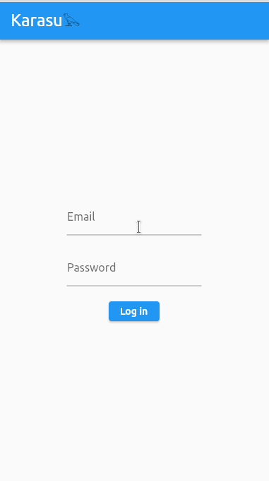

# Karasu 𓅂

Flashcard-based learning app influenced by the [spaced-repetition](https://en.wikipedia.org/wiki/Spaced_repetition)  methodology.


## Preview


## How to run
Install [Flutter](https://docs.flutter.dev/get-started/install) and do:

```
$ flutter run
```

Make sure to have [Toshokan](https://github.com/XaviFP/toshokan) running.

